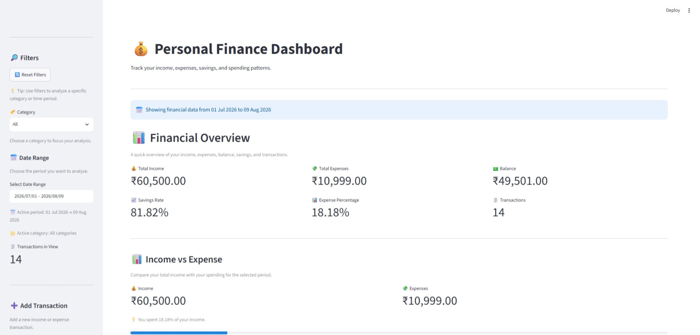
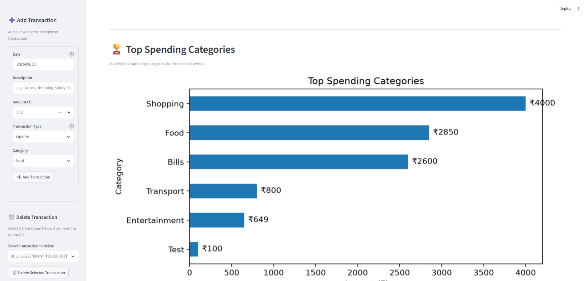
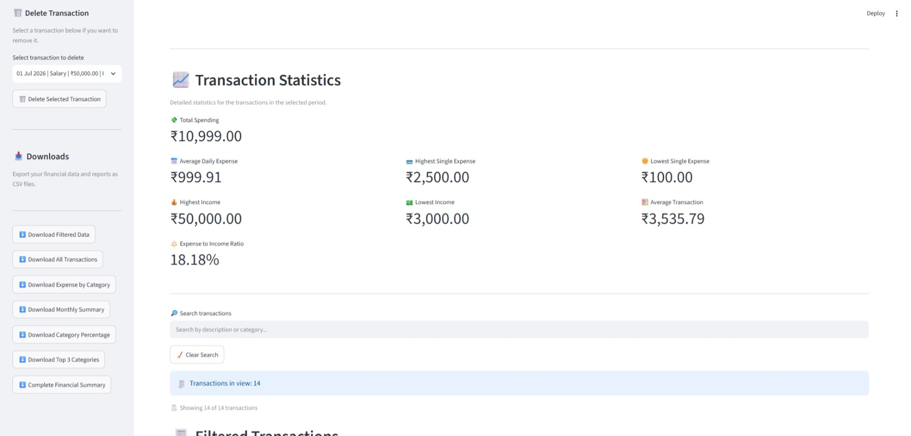
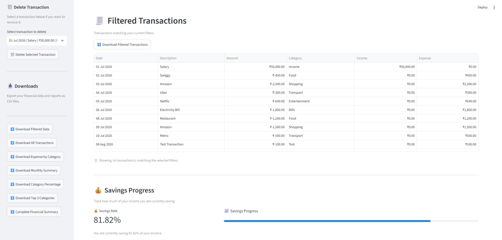
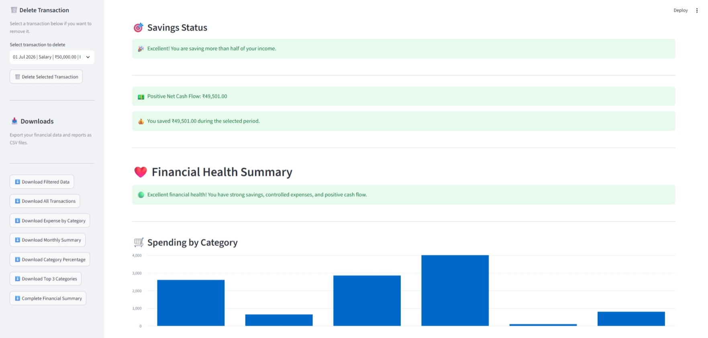
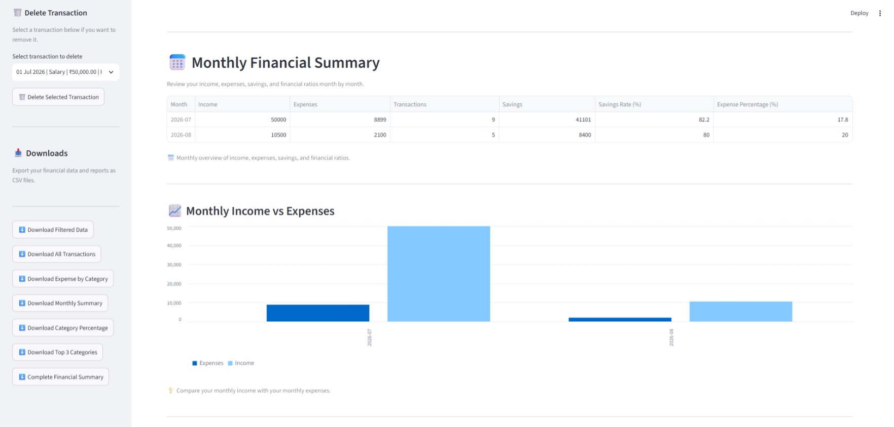
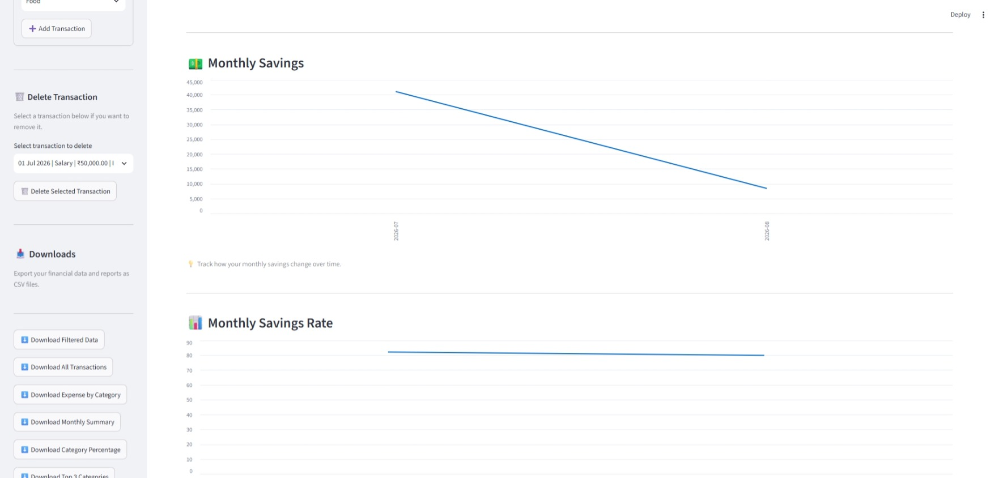
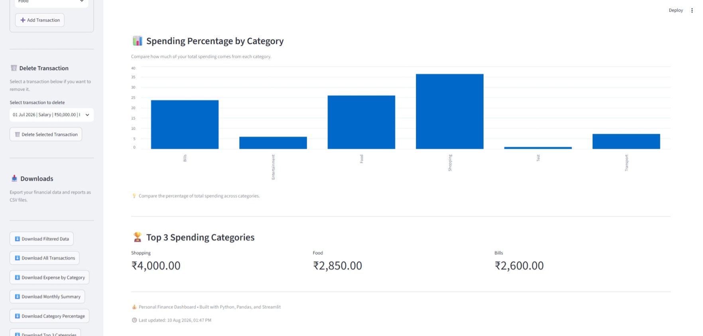

# 💰 Personal Finance Dashboard

A modern personal finance tracking and analytics dashboard built with **Python, Streamlit, Pandas, and Matplotlib**.

The dashboard helps users track income and expenses, analyze spending patterns, monitor savings, filter transactions, and download financial reports.

---

## 🌐 Live Demo

🚀 **Try the live dashboard:**

[](https://personal-finance-dashboard-g9njk5qduhg3ftvzuuzq8z.streamlit.app/)

👉 [Open Personal Finance Dashboard](https://personal-finance-dashboard-g9njk5qduhg3ftvzuuzq8z.streamlit.app/)

The dashboard is deployed using Streamlit Community Cloud.
---

## 📸 Dashboard Preview

### 📊 Dashboard 1 — Final Overview & Filters



---

### 💳 Dashboard 2 — Top Spending Categories & Add Transaction



---

### 📋 Dashboard 3 — Transaction Statistics & Delete Transaction



---

### 🔎 Dashboard 4 — Filtered Transactions & Savings Progress



---

### 💰 Dashboard 5 — Savings Status, Financial Health & Downloads



---

### 📅 Dashboard 6 — Monthly Financial Summary & Income vs Expenses



---

### 📈 Dashboard 7 — Monthly Savings & Savings Rate



---

### 📊 Dashboard 8 — Spending Percentage & Top 3 Categories



---
## 📌 Project Status

**Status:** ✅ Completed

The core dashboard functionality is complete, including:

- Financial KPI calculations
- Transaction management
- Category and date filtering
- Financial analytics
- Charts and visualizations
- Savings tracking
- CSV report downloads
- SQLite database integration
- Error and empty-data handling

---

## ✨ Features

### 📊 Financial Overview
- Total Income
- Total Expenses
- Current Balance
- Savings Rate
- Expense Percentage
- Expense-to-Income Ratio

### 💳 Transaction Management
- Add new transactions
- Delete transactions
- View filtered transactions
- Track income and expenses by category
- Search and filter transaction data

### 📈 Financial Analytics
- Monthly financial summary
- Spending by category
- Category spending percentage
- Top spending categories
- Average daily expense
- Highest transaction
- Lowest transaction
- Savings progress
- Savings status

### 🔎 Filters
- Category filtering
- Date-range filtering
- Reset filters

### 📥 Downloads
- Filtered transactions
- All transactions
- Monthly financial summary
- Expense by category
- Top 3 spending categories
- Category spending percentage
- Complete financial summary

---

## 🛠️ Tech Stack

- **Python**
- **Streamlit**
- **Pandas**
- **Matplotlib**
- **SQLite**
- **Git**
- **GitHub**

---

## 📂 Project Structure

```text
personal-finance-dashboard/
│
├── app.py
├── analytics.py
├── charts.py
├── data_manager.py
├── downloads.py
├── filters.py
├── processor.py
│
├── database/
│   └── database_manager.py
│
├── data/
│   └── transactions.csv
│
├── requirements.txt
├── README.md
└── .gitignore
```

---

## 🚀 Installation

Clone the repository

```bash
git clone https://github.com/rinkitala-commits/personal-finance-dashboard.git
```

Go to the project

```bash
cd personal-finance-dashboard
```

Install dependencies

```bash
pip install -r requirements.txt
```

Run the dashboard

```bash
python -m streamlit run app.py
```

---

## 📈 Future Improvements

- Budget Planner
- SQLite Database
- PDF Reports
- Excel Export
- Interactive Plotly Charts
- AI Spending Insights
- User Authentication
- Cloud Deployment

---

## 👩‍💻 Author

### Jhumarani Tala

B.Tech Data Science Student | Python Developer | Data Science & AI Enthusiast

GitHub:
https://github.com/rinkitala-commits
